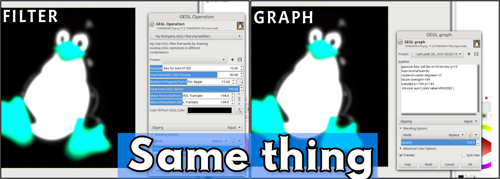

# GUIDE-to-make-third-party-GEGL-Filters
Yes this technically is a new filter that fuses Gaussian Blur, Hue Rotation, Rotation, A Glow effect, GEGL's move tool, and and a color fill background. But as you can see it is mostly incoherrent. This filter serves as an educational guide and template to help more people make third party GEGL filters. Nothing more and nothing less.

